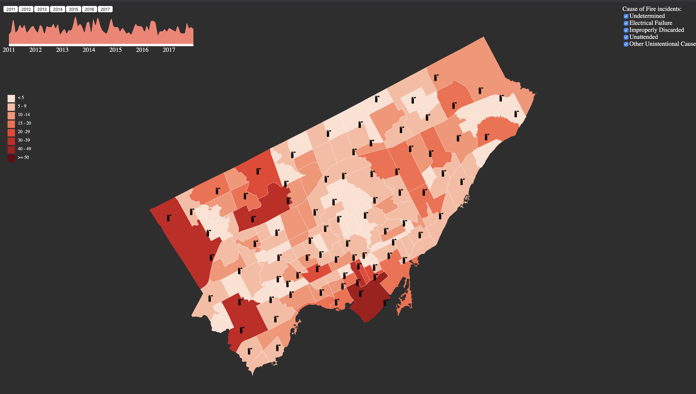

# Toronto Fire Incident

## Background

We chose the Toronto Fire incidents data set for this project since we want to create a visualization that allows the residents of Toronto and the city officials to have a better understanding of the services their fire department provides, the biggest causes of household fires and what streets have a higher chance of fires. Hopefully this visualization will aid stakeholders in making more informed decisions regarding city administration.

## How to Run

1. Make sure you have `python3` installed
2. Clone this repository by typing this on your terminal or command line `git clone https://github.com/jwdjj/TorontoFireIncident`
3. Move into the directory `cd TorontoFireIncident`
4. Run the application `python3 -m http.server 8080`
5. Open your browser and go to `http://0.0.0.0:8080/`

## Datasets

- [Kaggle](https://www.kaggle.com/phyxle/toronto-fire-incidents) which is originally from [Toronto Open Data](https://open.toronto.ca/) provides list of fire incidents in Toronto
- [Statistic Canada](https://www12.statcan.gc.ca/census-recensement/2016/dp-pd/prof/details/page.cfm?Lang=E&Geo1=CSD&Code1=3520005&Geo2=PR&Code2=35&SearchText=&SearchType=Begins&SearchPR=01&B1=Income&TABID=1&type=0) for Toronto census data which provides population and demographic datasets
- [Toronto Map - JSON](https://github.com/jasonicarter/toronto-geojson)

## Author
- [Terry Darmawan Hosea](https://github.com/terryhosea)
- [Mohammad Mushfequr Rahman](https://github.com/Mushfequr-Rahman)
- [Jessica](https://github.com/jwdjj)

## Acknowledgement

- http://bl.ocks.org/michellechandra/0b2ce4923dc9b5809922 for base code on showing the map
- https://www.r-bloggers.com/plotting-choropleths-from-shapefiles-in-r-with-ggmap-toronto-neighbourhoods-by-population/ for sketch reference
- http://cityinsight-interface.ssg.coop/toronto-emissions for sketch reference
- https://public.tableau.com/profile/lilly.tong#!/vizhome/shared/HNH4PXQRX for sketch and data reference
- https://bl.ocks.org/duspviz-mit/9b6dce37101c30ab80d0bf378fe5e583 for gradient legend
- https://bl.ocks.org/jkeohan/b8a3a9510036e40d3a4e for box legend