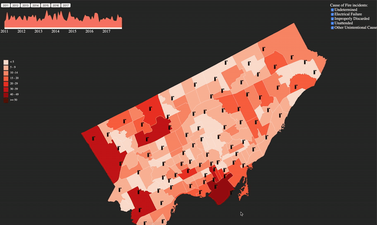

# Toronto Fire Incident

## Background

We chose the Toronto Fire incidents data set for this project since we want to create a visualization that allows the residents of Toronto and the city officials to have a better understanding of the services their fire department provides, the biggest causes of household fires and what streets have a higher chance of fires. Hopefully this visualization will aid stakeholders in making more informed decisions regarding city administration.

## How to Run

1. Make sure you have `python3` installed
2. Clone this repository by typing this on your terminal or command line `git clone https://github.com/jwdjj/TorontoFireIncident`
3. Move into the directory `cd TorontoFireIncident`
4. Run the application `python3 -m http.server 8080`
5. Open your browser and go to `http://0.0.0.0:8080/`

Note: recommended browser is **Google Chrome**

## Datasets

- [Toronto Open Data](https://open.toronto.ca/dataset/fire-incidents/) provides list of fire incidents in Toronto
- [Statistic Canada](https://www03.cmhc-schl.gc.ca/hmip-pimh/en/TableMapChart/TableMatchingCriteria?GeographyType=MetropolitanMajorArea&GeographyId=2270&CategoryLevel1=Population%2C%20Households%20and%20Housing%20Stock&CategoryLevel2=Household%20Income&ColumnField=HouseholdIncomeRange&RowField=Neighbourhood&SearchTags%5B0%5D.Key=Households&SearchTags%5B0%5D.Value=Number&SearchTags%5B1%5D.Key=Statistics&SearchTags%5B1%5D.Value=AverageAndMedian) for Toronto census data which provides income by neigbourhood
- [Toronto Map - JSON](https://github.com/jasonicarter/toronto-geojson)
- [Toronto Fire Station](https://www.toronto.ca/community-people/public-safety-alerts/understanding-emergency-services/fire-station-locations/)

## Author
- [Terry Darmawan Hosea](https://github.com/terryhosea)
- [Mohammad Mushfequr Rahman](https://github.com/Mushfequr-Rahman)
- [Jessica](https://github.com/jwdjj)

## Known Issues
- A known "brush" issue within [d3 community](https://github.com/d3/d3-brush/issues/60) on Firefox and IE Edge
- Not recommended at all to run this application on Safari

## Acknowledgements

- [Map Base Code](http://bl.ocks.org/michellechandra/0b2ce4923dc9b5809922)
- [Legend Base Code](https://embed.plnkr.co/plunk/gE1xQu)
- [Date Filter Base Code](http://bl.ocks.org/timelyportfolio/5c136de85de1c2abb6fc)
- [Tooltip Base Code](https://bl.ocks.org/tiffylou/88f58da4599c9b95232f5c89a6321992 )
- [Sketch Reference 1](https://www.r-bloggers.com/plotting-choropleths-from-shapefiles-in-r-with-ggmap-toronto-neighbourhoods-by-population/ )
- [Sketch Reference 2](http://cityinsight-interface.ssg.coop/toronto-emissions)
- [Sketch Reference 3](https://public.tableau.com/profile/lilly.tong#!/vizhome/shared/HNH4PXQRX)